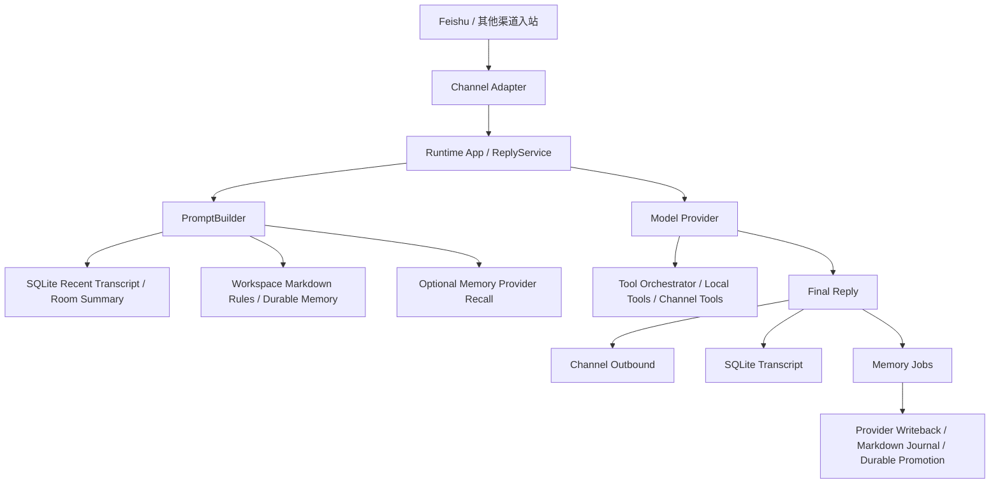

# GoClaw 系统架构与开发进度总览

## 文档目的

这是一份给多线程协作维护的中文总览文档。

目标有两个：

1. 统一记录 GoClaw 当前的系统架构边界，避免每个线程对核心概念有不同理解。
2. 统一记录当前开发进度，方便不同线程把自己完成的模块补进同一份文档。

建议维护规则：

- 新增能力时，优先更新对应模块的“当前状态”和“已完成内容”。
- 如果某项只是设计未落地，写进“设计状态”，不要写成“已完成”。
- 如果多个线程并行改同一模块，优先按“架构边界”和“可运行状态”写，不要写成逐文件 changelog。

---

## 一、系统总体架构

### 1. 核心设计原则

GoClaw 当前采用的核心方向是：

- 以 **Person-first isolation** 为主，即真实的人是主隔离单位。
- 以 **Room** 作为聊天空间层，通常对应一个飞书 `chat_id`。
- 以 **Conversation** 作为 room 内部的逻辑话题层，用来承载独立的规则、记忆设定和局部上下文。
- 以 **可插拔 memory provider + 本地 Markdown durable memory** 的双层记忆模型为目标。
- 对外部聊天面当前保持 **final-only** 交付，不向外部渠道发送 streaming/partial reply。

### 2. 领域模型分层

当前可以把 GoClaw 的运行时边界理解成下面四层：

1. `Profile`
   - 机器人实例层。
   - 承载 profile 级规则、人格、工具约定、模型默认值。
2. `Person`
   - 真实的人。
   - 当前主键约定是飞书用户 `open_id`。
3. `Room`
   - 聊天空间。
   - 当前主键约定是飞书 `chat_id`。
   - 群聊和私聊都属于 room，只是 `kind` 不同。
4. `Conversation`
   - room 内部的逻辑话题/工作流层。
   - 当前飞书第一版通常仍可只用默认 conversation，但架构上已经是一等对象。

### 3. 存储与状态面

当前系统分成三类状态面：

- `SQLite`
  - 主业务状态和运行时事实源。
  - 存 profile、person、room、conversation、session、message、consent、tool permissions、memory jobs 等。
- `Workspace Markdown`
  - 稳定、可人工维护、可审计的 durable 层。
  - 主要放规则文件、稳定记忆文件、journal 文件。
- `Optional Memory Provider`
  - 可选的自动 recall / 模糊检索层。
  - 当前已经有可选 `MemOS` 接口实现。

### 4. 模块级架构图

### 5. 当前高层目录职责

- `cmd/goclaw`
  - CLI 入口和 operator 命令。
- `internal/config`
  - 运行时配置模型和环境变量装配。
- `internal/domain`
  - 领域对象和状态枚举。
- `internal/store/sqlite`
  - SQLite 仓储边界。
- `internal/runtime`
  - runtime wiring、reply flow、prompt build、memory jobs、compaction。
- `internal/workspace`
  - Markdown workspace 读取、journal 写入、durable memory 写入与冲突处理。
- `internal/memory`
  - memory provider 抽象和 provider 实现。
- `internal/model`
  - 模型 provider 抽象与 adapter。
- `internal/tools`
  - 工具目录、编排器、repair/sanitize、本地工具运行时。
- `internal/channels`
  - provider-agnostic 渠道层。
- `internal/feishu`
  - 飞书原始 transport 和 provider-specific 适配。

---

## 二、当前系统的稳定边界

### 1. 记忆系统稳定边界

当前记忆系统的正式分层是：

1. `SQLite transcript/session state`
   - 保存原始消息、room summary、conversation settings、consent、memory jobs。
2. `Workspace durable memory`
   - 保存可人工维护的稳定事实和 journal。
3. `Optional provider memory`
   - 保存可选的自动 recall / 模糊检索数据。

读取顺序大体是：

1. recent transcript / room summary
2. Markdown durable memory / journal recall
3. provider recall

写入顺序大体是：

1. assistant reply 落 transcript
2. 进入 `memory_jobs`
3. 由后台 worker 决定写 provider、写 journal、还是升格 durable facts

### 2. 工具系统稳定边界

当前工具系统已经从“临时 JSON 协议”收敛到结构化方向：

- 有统一的 tool catalog。
- 有 shared orchestrator。
- 有 room 级 tool permission policy。
- `Anthropic` 已走 native tool-calling。
- `openai-compatible` 正在朝结构化 native tooling 收敛。
- legacy JSON fallback 仍存在，但已经不是长期主路径。

### 3. 运行时稳定边界

当前运行时的生产性约束是：

- 外部渠道只发 final reply。
- 记忆沉淀走 post-reply jobs，不强绑定在 reply latency 上。
- consent、conversation settings、tool policy 都属于 run 前确定的控制面。
- streaming 设计已立项，但还没成为对外可见默认能力。

---

## 三、本线程已完成的模块

这一节只记录我这条线程已经完成并落地到代码的部分。

### A. 记忆分层与 durable memory 主线

#### 已完成

- 建立了 `person / room / conversation` 三层记忆边界。
- 记忆体系从单一 provider recall 扩展为：
  - SQLite 会话态
  - Markdown durable memory
  - optional memory provider
- 引入并落地了 workspace-backed Markdown 目录体系：
  - `profiles/<profile_id>/AGENTS.md`
  - `profiles/<profile_id>/SOUL.md`
  - `profiles/<profile_id>/IDENTITY.md`
  - `profiles/<profile_id>/TOOLS.md`
  - `persons/<person_id>/USER.md`
  - `persons/<person_id>/SUMMARY.md`
  - `persons/<person_id>/MEMORY.md`
  - `persons/<person_id>/memory/*.md`
  - `rooms/<room_id>/ROOM.md`
  - `rooms/<room_id>/MEMORY.md`
  - `rooms/<room_id>/memory/*.md`
  - `conversations/<room_id>/<slug>/CONVERSATION.md`
  - `conversations/<room_id>/<slug>/MEMORY.md`
  - `conversations/<room_id>/<slug>/memory/*.md`
- `HEARTBEAT.md` 和 `conversations/.../settings.json` 目前仍属于目标分层，不应误写成已落地。
- 明确了 person durable memory 的 summary/private 分层：
  - `summary` consent 读取 `SUMMARY.md`
  - `full` consent 额外读取 `MEMORY.md` 和 private journals

#### 当前状态

- 这一部分已经不是设计稿，而是代码已落地。
- 目前 durable memory 已经可以被 recall、被显式 promote、被自动 promote、被审核后 resolve。
- 当前已落地的是 Markdown durable memory 和 SQLite conversation settings 双轨模型：
  - durable facts 在 workspace Markdown
  - conversation settings 仍以 SQLite 为正式事实源
- 因此其他线程维护文档时，要区分“目标文件层”与“当前运行时事实源”，不要把目标分层直接写成现状。

### B. Markdown journal 与 durable promotion

#### 已完成

- journal 写入已经通过 `memory_jobs` 后台化。
- durable Markdown promotion 已支持：
  - 直接写
  - queued background write
- 已实现的 CLI：
  - `goclaw memory promote`
  - `goclaw memory promote --defer`
  - `goclaw memory jobs run-once`

#### 当前状态

- durable promotion 已是可用能力。
- 不是临时脚本，而是正式进入 runtime / repo / CLI 主链路。
- `goclaw serve` 下由 `MemoryJobWorker` 统一排水，operator 也可以用 `goclaw memory jobs run-once` 手动排空队列做验证。
- 当前 `memory_jobs` 承载的正式后台任务包括：
  - provider writeback
  - Markdown journal writeback
  - queued durable promotion

### C. Auto-promote 记忆提炼

#### 已完成

当前 auto-promote 已经分成三层：

1. 显式模式
   - `remember ...`
   - `记住...`
2. 弱模式
   - 少量低风险自然语言句式
3. 强模式
   - 从 recent transcript + workspace journals 做规则式提炼
   - 通过证据阈值控制 promotion

#### 相关控制面

- 全局开关
  - `GOCLAW_MEMORY_AUTO_PROMOTE_ENABLED`
- 弱模式开关
  - `GOCLAW_MEMORY_AUTO_PROMOTE_WEAK_PATTERNS_ENABLED`
- 强模式开关
  - `GOCLAW_MEMORY_AUTO_PROMOTE_STRONG_PATTERNS_ENABLED`
- 来源开关
  - `GOCLAW_MEMORY_AUTO_PROMOTE_SOURCE_TRANSCRIPT_ENABLED`
  - `GOCLAW_MEMORY_AUTO_PROMOTE_SOURCE_JOURNALS_ENABLED`
- 证据阈值
  - `GOCLAW_MEMORY_AUTO_PROMOTE_MINIMUM_EVIDENCE`
- 分层开关
  - `GOCLAW_MEMORY_AUTO_PROMOTE_CONVERSATION_ENABLED`
  - `GOCLAW_MEMORY_AUTO_PROMOTE_ROOM_ENABLED`
  - `GOCLAW_MEMORY_AUTO_PROMOTE_PERSON_SUMMARY_ENABLED`
  - `GOCLAW_MEMORY_AUTO_PROMOTE_PERSON_PRIVATE_ENABLED`

#### 当前约束

- `person_private` 仍然保持显式写入优先，不允许普通自动提炼直接写入。
- 强模式当前仍然是规则式、可解释的，不用模型做黑盒推断。

### D. Durable conflict review 审核闭环

#### 已完成

- 对 typed durable facts 增加了冲突检测，当前覆盖：
  - 用户偏好
  - 首选称呼
  - room 用途
  - conversation 焦点
- auto-promote 命中冲突时，不再直接写 durable file。
- 改为进入 review 队列。
- 增加 review 状态：
  - `review_pending`
  - `rejected`
- 增加 operator CLI：
  - `goclaw memory review list`
  - `goclaw memory review approve --job-id <id>`
  - `goclaw memory review reject --job-id <id>`
- `approve` 现在不是简单追加，而是：
  - 退休旧冲突事实
  - 写入新批准事实
  - 保留无关 durable facts 不动

#### 当前状态

- 这一部分已经形成完整闭环：
  - 冲突检测
  - review queue
  - manual approve/reject
  - durable file resolve

### E. Capability Prompt Layer

#### 已完成

- 定义并接入了能力披露层，让模型知道自己当前有哪些能力。
- 当前模型请求里已经稳定带有这些 block：
  - `Capabilities`
  - `Tooling`
  - `Tool Call Style`
  - `Memory`
  - `Runtime Limits`
- 这层会反映真实运行时状态，而不是手写文案。

#### 当前状态

- capability prompt phase 1 已落地。
- 后续仍应与正式的 tool exposure planner 持续对齐。

---

## 四、本线程相关设计稿索引

我这条线程主要落地和维护过的设计稿有：

- `docs/plans/2026-03-11-memory-layering-design.md`
- `docs/plans/2026-03-11-capability-prompt-design.md`
- `docs/plans/2026-03-10-streaming-runtime-design.md`

其他线程如果继续写“记忆、能力披露、runtime streaming”相关内容，建议优先对齐这些设计稿。

---

## 五、待其他线程补充的模块

下面这些模块由其他线程继续补充；本次已补入的进展也统一记录在这里，后续请继续在原小节上增量更新。

### 1. 渠道与飞书主线

#### 已补充

- Feishu 已正式挂到 `internal/channels` 的统一渠道边界下，而不是 runtime 特判。
- 当前入站同时支持：
  - `webhook`
  - `longpoll`
- Feishu outbound 现在除了 `SendText(...)` 外，还支持 processing ack：
  - 收到消息后先加一个临时 reaction
  - 回复完成或失败后移除该 reaction
- processing ack emoji 已配置化：
  - top-level `channels.feishu.processingAckEmoji`
  - account-level `channels.feishu.accounts.<id>.processingAckEmoji`
  - 默认值是 `THUMBSUP`
- 长连接 runner 已补上瞬时断链自动重连：
  - `close 1006`
  - `unexpected EOF`
  - `connection reset by peer`
  - `broken pipe`

#### 当前状态

- Feishu 已经具备可运行的 channel 主链路：
  - 消息入站
  - 事件持久化
  - 自动回复
  - processing ack
  - 长连接重连
- `longpoll` 模式下，不使用 `EncryptKey`、`VerificationToken` 和本地 webhook bind 配置。
- 多账号解析仍然保持在 Feishu channel 自己的配置解析层，不泄漏到 runtime。
- `(provider, profile_id)` 已经是 outbound 路由和 tool/account 绑定的正式键，不再是单一 profile 维度。
- scope 和 capability diagnostics 当前明确留在 channel / CLI 边界，不直接把原始 Feishu scopes 注入模型 prompt。

#### 仍待补充

- 更完整的 outbound diagnostics
- chat management 的 operator 侧说明
- 非 Feishu 渠道接入后的对比状态

### 2. 模型与 provider 主线

#### 已补充

- `Anthropic` 已稳定接入 native tool-calling。
- `openai-compatible` 已拆成两条正式 adapter 路线：
  - `responses / codex-responses`
  - `chat/completions`
- `openai-compatible` 当前已落地的 structured tooling 范围包括：
  - request tool schema 注入
  - assistant tool-call replay
  - tool result replay
  - 多轮 native tool loop
  - provider-specific transcript repair
- `openai-completions` 已补齐第一轮 production-grade 收口：
  - strict tool-call id sanitize 与冲突去重
  - assistant-first bootstrap repair
  - send-time transcript repair
  - `parallel_tool_calls=true` payload 注入
  - repeated same-family tool round 的内部 exploration hint

#### 当前状态

- provider tooling 主路径已经不是 prompt-only 或 legacy JSON envelope，而是以 native structured tooling 为正式方向。
- `Anthropic` 与 `openai-compatible` 已构成当前最稳定的两条 structured tooling provider 线。
- `openai-compatible` 里最复杂的是 `chat/completions`，这一条现在已经不只是“能跑”，而是具备了与 OpenClaw 同方向的 repair / replay / 收口机制。

#### 仍待补充

- 更多 provider adapter 的收敛顺序
- provider-specific streaming 能力和限制矩阵
- 更完整的 provider 故障排查说明

#### 设计稿索引

- `docs/plans/2026-03-11-tooling-runtime-design.md`

### 3. 工具系统主线

#### 已补充

- 当前工具系统已经形成统一 `agenttools` 边界：
  - `Definition`
  - `ExecutionContext`
  - `Registry`
  - `Result envelope`
  - `Audit metadata`
- 本地工具和渠道工具已经进入同一个 registry：
  - local tools 继续承载 `exec/read/write/fetch`
  - channel tools 通过 channel-owned provider 注入
- orchestrator 已经统一走 registry dispatch，而不是 local tool 特判。
- tool audit 已统一持久化：
  - `tool_name`
  - `tool_source`
  - `provider`
  - `capability_id`
  - `decision_json`
- `decision_json` 已经不再是空壳，而是包含 allow/deny、reason、source、provider、safety class、capability id 的结构化事实。
- room policy CLI 已补齐 channel 维度控制面：
  - `channel_introspection_mode`
  - `channel_read_mode`
  - `channel_write_mode`
  - `channel_sensitive_mode`
  - provider/tool allow/deny lists

#### 当前状态

- 工具系统已经不是“只有本地工具”的阶段，而是统一 fabric 的第一版。
- `Anthropic` native tool path、legacy fallback、channel tools 现在都复用同一套 registry / audit / policy 面。
- `openai-completions` 这条最容易失控的 native path，现在也已经纳入同一套 structured runtime 收口：
  - full transcript repair
  - orphan / duplicate tool-result cleanup
  - synthetic missing tool result
  - configurable `tooling.maxIterations`
  - `parallel_tool_calls=true`
- tool audit 已经形成正式 operator 面：
  - `agent_reply_runs`
  - `tool_invocations`
  - `goclaw tooling runs`
  - `goclaw tooling invocations`
- 当前工具主路径的关键控制面已经成型：
  - `GOCLAW_TOOLING_LEGACY_JSON_FALLBACK_ENABLED` 控制 legacy 文本协议是否作为实验兼容路径启用
  - `tooling.maxIterations` / `GOCLAW_TOOLING_MAX_ITERATIONS` 控制 native tool loop 最大轮数
- local tool 审计也已经能反映真实 command/path/network 决策，而不是只记“可见/不可见”。

#### 仍待补充

- 更细的 operator 文档和故障排查说明
- channel tools 与 local tools 的更统一风险分级
- 更完整的 tool decision / safety policy 解释文档

#### 设计稿索引

- `docs/plans/2026-03-11-tooling-runtime-design.md`

### 4. 渠道工具与能力披露主线

#### 已补充

- channel-owned tool provider contract 已落地到 `internal/channels/types.go`。
- `agenttools` contract 已正式收口：
  - `ProfileBindingMode`
  - bound account metadata
  - provider metadata
  - mandatory `CapabilitySummary(...)`
- capability summary 已经不是 provider-specific 可选附加接口，而是 channel tool contract 的正式部分。
- Feishu 已接入的 introspection tools：
  - `feishu_app_scopes`
  - `feishu_capabilities_status`
  - `feishu_chat_get`
  - `feishu_chat_members`
- Feishu 已接入的 mutating tools：
  - `feishu_message_update`
  - `feishu_message_recall`
  - `feishu_reaction_add`
  - `feishu_reaction_delete`
  - `feishu_pin_add`
  - `feishu_pin_delete`
- capability disclosure 三层已经打通：
  - prompt static context
  - prompt capability summary
  - on-demand introspection tools

#### 当前状态

- prompt 里已经会反映：
  - `channel_tools`
  - `channel_tool_names`
  - `channel_scope_summary`
  - `channel_mutations`
- visible tool 集合已经受 room policy 过滤，并和 capability summary 对齐。
- operator 侧已经有一组正式 Feishu IM CLI，可直接做 chat / message / reaction / pin / scopes / capabilities 诊断与操作。
- 旧显式 policy 如果只开了 channel `allow_list` 但没写 allow provider，现在会自动继承当前 room provider，不再把当前 provider 的 channel tools 意外藏掉。

#### 仍待补充

- 更抽象的 capability exposure planner 文档
- 非 Feishu provider 的 channel tool 对接情况
- 后续更多 channel-specific tools 的矩阵说明

### 5. 运行时与 streaming 主线

#### 已补充

- runtime 在 run 前已经会解析并注入能力快照：
  - local tools
  - channel tools
  - memory scopes
  - runtime limits
  - tool policy summary
- tool loop 的 session context 已经补齐 provider message 语义，不再把内部 `msg:feishu:...` 误传成渠道原始 `message_id`。
- final-only 外部交付边界仍然保持，但运行时内部已经具备：
  - capability prompt snapshot
  - native tool execution
  - audit hooks
  - memory post-run jobs
  - reply run / tool invocation 审计持久化
- processing ack 已经并入 reply path：
  - 开始处理时设置
  - 正常回复后清除
  - 生成失败也清除

#### 当前状态

- 运行时正在从“单次 reply 逻辑”演进到更正式的 run-time control plane，但 streaming 仍不是默认对外能力。
- 当前对外稳定边界依然是：
  - 外部渠道只发 final reply
  - 内部可以有 tool loop、capability snapshot、post-run jobs
- runtime 现在已经会把一次回复尝试记录成可审计 run，而不是只留下日志：
  - `agent_reply_runs` 记录 run 生命周期
  - `tool_invocations` 记录每次工具调用生命周期
- 对 `openai-completions`，运行时这条线已经不只是依赖 provider 自然收敛，还会通过 transcript repair、并行工具提示和 exploration hint 主动减少无效回合。
- 这条线程补的是 runtime correctness 和 control plane 收口，不是完整 streaming event bus。

#### 仍待补充

- Run Snapshot / Run Event 的正式模型
- internal streaming 与 external final-only 的完整分层
- finalizer / event bus / observer 链路的统一说明

#### 设计稿索引

- `docs/plans/2026-03-11-tooling-runtime-design.md`
- `docs/plans/2026-03-10-streaming-runtime-design.md`

---

## 六、全局剩余任务板

这一节不按单线程写，而是从整个项目角度记录当前最值得并行推进的缺口。

### 1. streaming runtime 正式落地

- 当前外部 final-only 边界已经稳定，但内部 `RunSnapshot` / `RunEvent` / finalizer / observer 还停留在设计态。
- 后续如果有线程负责 runtime streaming，建议优先对齐：
  - `docs/plans/2026-03-10-streaming-runtime-design.md`

### 2. provider-native tooling 继续扩展和收敛

- `Anthropic` 与 `openai-compatible` 已经进入 structured native tooling 主路径。
- 但 provider 能力矩阵、provider-specific repair、故障排查文档还没有完全收口。

### 3. memory review 的 diff / preview operator 面

- 当前 `approve` 已能正确 retire 旧事实并写入新事实。
- 但 operator 在真正落盘前，还缺“这次会删什么、会新增什么”的可视化预览。

### 4. channel tool fabric 和 operator 文档

- 当前 Feishu channel tools、capability summary、room policy 已经形成一条正式链路。
- 但更完整的风险分级、故障排查、跨渠道对比说明还没补齐。

---

## 七、当前我对项目状态的判断

如果只看我这条线程负责的部分，GoClaw 在“按人隔离的记忆系统”这一条线上，已经从概念验证进入了 **可运行开发版** 阶段。

更具体地说：

- 记忆分层已经成型。
- durable memory 已经可读、可写、可自动提炼、可审核、可冲突解决。
- capability prompt 已经把“模型知道自己有什么能力”这件事从零散文本提升成了正式层。

但整个系统距离“生产版本”还有这些共性缺口：

- streaming runtime 还没有完整落地。
- 多 provider 的 native structured tooling 主干已经立住，但还未完全收敛到完整矩阵。
- channel tool fabric 还在持续演进。
- 运行时审计与 operator 面已经有第一版，但更强的运维可观测性和最终生产化收尾还没完成。

---

## 八、建议其他线程追加内容时的写法

建议保持这个格式：

1. 先写“模块名称”
2. 再写“已完成”
3. 再写“当前状态”
4. 如果有对应设计稿，再补“设计稿索引”

尽量不要直接写成逐文件变更清单。优先写：

- 架构边界
- 能力状态
- 是否已落地
- 还剩什么
